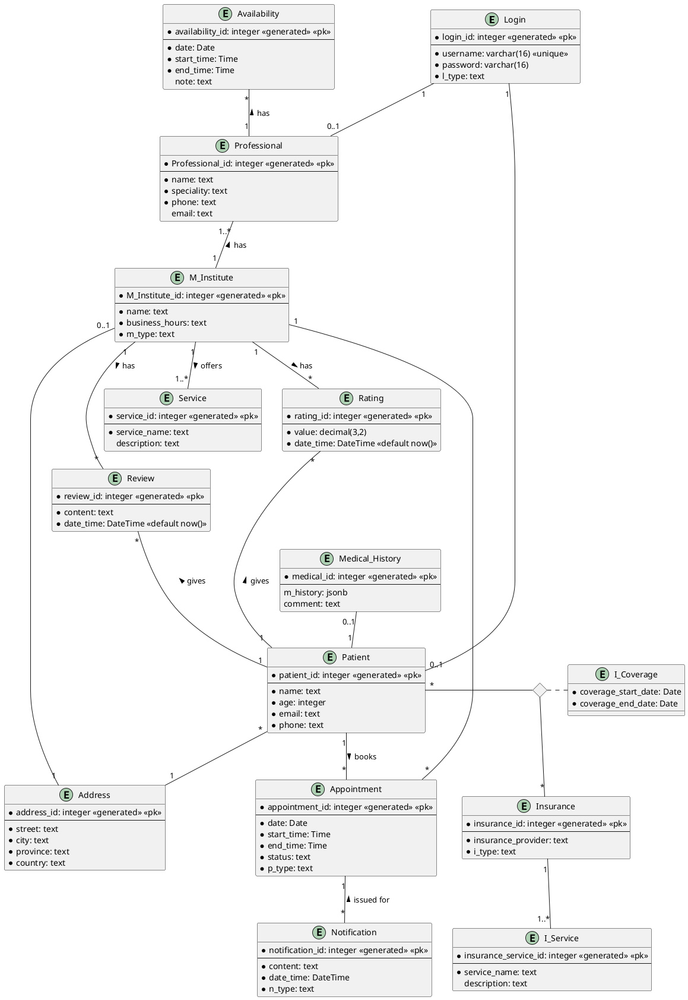

# Logical diagram

```plantuml
@startuml
entity Login{
*login_id: integer <<generated>> <<pk>>
--
*username: varchar(16) <<unique>>
*password: varchar(16)
*l_type: text
}
entity Professional {
*Professional_id: integer <<generated>> <<pk>>
--
*name: text
*speciality: text
*phone: text
email: text
}
entity Availability {
*availability_id: integer <<generated>> <<pk>>
--
*date: Date
*start_time: Time
*end_time: Time
note: text
}
entity M_Institute{
*M_Institute_id: integer <<generated>> <<pk>>
--
*name: text
*business_hours: text
*m_type: text
}

entity Service{
*service_id: integer <<generated>> <<pk>>
--
*service_name: text
description: text
}
entity Patient{
*patient_id: integer <<generated>> <<pk>>
--
*name: text
*age: integer
*email: text
*phone: text
}
entity Appointment {
*appointment_id: integer <<generated>> <<pk>>
--
*date: Date
*start_time: Time
*end_time: Time
*status: text
*p_type: text
}

entity Notification {
*notification_id: integer <<generated>> <<pk>>
--
*content: text
*date_time: DateTime
*n_type: text
}
entity Review {
*review_id: integer <<generated>> <<pk>>
--
*content: text
*date_time: DateTime <<default now()>> 
}
entity Rating {
*rating_id: integer <<generated>> <<pk>>
--
*value: decimal(3,2)
*date_time: DateTime <<default now()>> 
}
entity Insurance {
*insurance_id: integer <<generated>> <<pk>>
--
*insurance_provider: text
*i_type: text
}
entity I_Coverage {
*coverage_start_date: Date
*coverage_end_date: Date
}
entity I_Service{
*insurance_service_id: integer <<generated>> <<pk>>
--
*service_name: text
description: text
}
entity Medical_History {
*medical_id: integer <<generated>> <<pk>>
--
m_history: jsonb
comment: text
}
entity Address {
*address_id: integer <<generated>> <<pk>>
--
*street: text 
*city: text
*province: text
*country: text
}

M_Institute "0..1" - "1" Address
Patient "*" -- "1" Address

Login "1"--"0..1" Patient
Login "1"-- "0..1" Professional

Patient "1" -- "*" Appointment: books >
<> patient_insurance
Patient "*" - patient_insurance
patient_insurance -- "*" Insurance
patient_insurance. I_Coverage
Medical_History "0..1" -- "1" Patient
Review "*" - "1" Patient: gives <
Rating "*" --- "1" Patient: gives <

Insurance "1" -- "1..*" I_Service

Appointment "1" -- "*" Notification: issued for <

Availability "*" -- "1" Professional: has <
Professional "1..*"--"1" M_Institute: has <
M_Institute "1"-- "*"Appointment
M_Institute "1" --"1..*" Service: offers >
M_Institute "1" -- "*" Rating: has >
M_Institute "1" -- "*" Review: has >
@enduml
```
