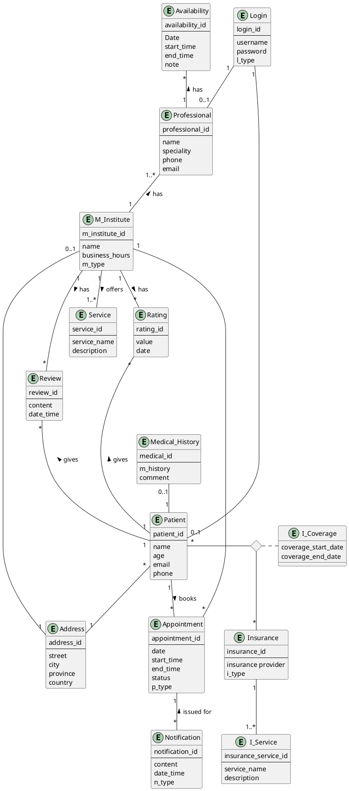
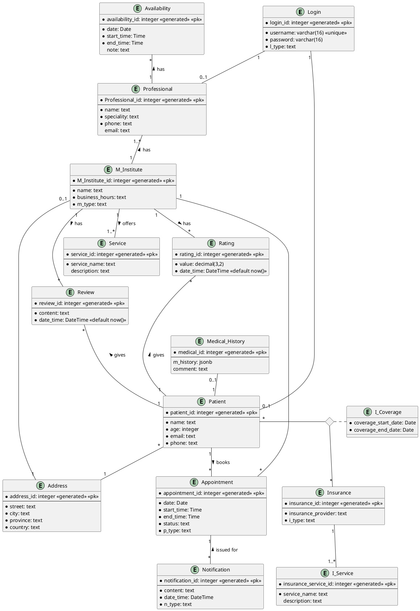
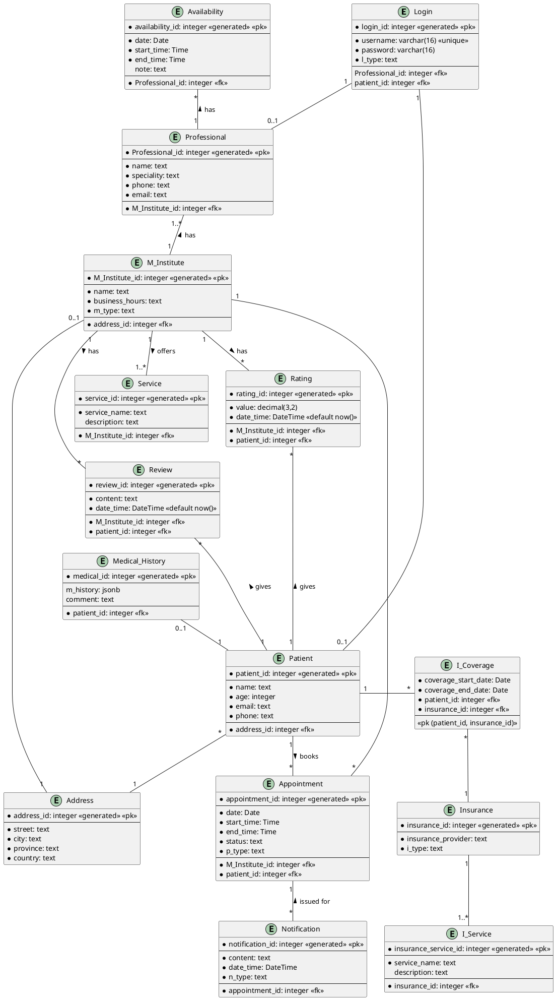

# <u>Project Description:</u>
### Title: Medical Appointment Booking System
This database system is designed to be linked to a web and/or mobile-based application and has been built to simplify managing and scheduling medical appointment in a country. 
The user can book an appointment with doctors in a specific medical institute based on their needs, healthcare insurance, location, and more. 
The main goal of this system is to provide a user-friendly platform for users (patients, doctors, and other healthcare providers) and help the healthcare providers to deliver their services in efficient way.

The basic features of this application include: 
- User accounts: patients and professionals can create an account and manage their accounts and their personal information.
- Search: Patients can search for a doctor/healthcare provider based on the location, availability, specialty, type of the healthcare insurance.
- Appointments (scheduling, rescheduling and canceling): patients can book an appointment based on the doctor/healthcare-provider schedule/availability. They can also reschedule or cancel appointments, allowing other users to book those time slots and reducing no-shows.
- Notifications: patients can receive a confirmation and reminder notifications in different ways from the system.
- Review and rating: patients can write a review and rate medical institutes allowing others to know the quality of the offered services at these institutes.
- Medical history records: healthcare providers can access their patients’ medical history to provide better services. 
- Patients can check the services offered by the medical institutes, names of the professionals, and their availabilities and specialities.
- Medical institutes can check patients' insurance and the services covered by these different insurances.
- Medical institutes can access some of their patients' personal information like their age, emails, phone numbers and addresses.

### Real-Life Similar Systems:
- [Quebec-Medical-Appointment-Scheduler](https://www.rvsq.gouv.qc.ca/accueil/index-en.html).
- [Ontario Medical-Appointment-Scheduler](https://www.ontariohealth.ca/system-planning/digital-standards/online-appointment-booking)
- [Quebec HUB](https://www.quebechub.ca/)
- [Clic Santé - Quebec](https://portal3.clicsante.ca/)

### Project's Data Overview
- Login credentials: usernames, passwords for patients and healthcare providers.
- Patient: ID, name, age, address, email, phone number. 
- Professionals: ID, name, details about healthcare providers, including their specialties, contact information, availability, and associated clinics or hospitals.
- medical institutes: details about clinics and hospitals where healthcare providers practice, including names, locations, contact information, and business hour. 
- Services offered: laboratory tests, vaccines, non-urgent medical consultation, physiotherapy session (with Clinics/Hospitals).
- Appointments: information about scheduled appointments, including appointment ID, patient details, healthcare provider details, date, time, and status (canceled, rescheduled), type of appointment (in-person, video, or telephone). 
- Notifications: data stored for notifications sent to patients and healthcare providers regarding appointment reminders, updates, and other important information. User preference for receiving notifications: email, SMS, app notification, call.
- Review/Ratings: patients can review/rating the professionals and local (clinics).
- Insurance information: patient with public/private insurance, services covered by this insurance.
- Medical history: patients will be asked about/give access to their general health, including allergies to food/animals, current medication, and previous surgeries.

# Conceptual diagram



# Logical diagram



# Physical diagram



# Create the database

Creating the schema and setting the path to it:

```postgresql
drop schema if exists BookingSystem CASCADE;
create schema if not exists BookingSystem;
set search_path to BookingSystem;

```

Creating the tables:

```postgresql
-- Create a domain
drop domain if exists email;
create domain email as text check ((length(value) >= 6) AND (value ~~* '%@%.%'::text));

-- Create the tables
create table address
(
    address_id integer generated always as identity
        primary key,
    street     text not null,
    city       text not null,
    province   text not null,
    country    text not null
);

create table m_institute
(
    m_institute_id integer generated always as identity
        primary key,
    name           text    not null,
    business_hours text    not null,
    m_type           text    not null,
    address_id     integer not null references address (address_id)
);
create table Service
(
    service_id     integer generated always as identity
        primary key,
    service_name   text    not null,
    description    text,
    m_institute_id integer not null references m_institute (m_institute_id)
);
create table professional
(
    professional_id integer generated always as identity
        primary key,
    name            text    not null,
    speciality      text    not null,
    phone           text    not null,
    email           email,
    m_institute_id  integer not null references m_institute (m_institute_id),
    unique (name, speciality)

);
create table availability
(
    availability_id integer generated always as identity
        primary key,
    date            date    not null,
    start_time      time    not null,
    end_time        time    not null,
    note            text,
    professional_id integer not null references professional (professional_id),
    constraint availability_check check (end_time >= start_time)
);

create table patient
(
    patient_id integer generated always as identity
        primary key,
    name       text    not null,
    age        integer not null,
    email      email   not null,
    phone      text    not null,
    address_id integer not null references address (address_id)
);

create table login
(
    login_id        integer generated always as identity
        primary key,
    username        varchar(16) not null unique
        constraint login_username_check
            check (length((username)::text) >= 3),
    password        varchar(16) not null
        constraint login_password_check
            check (length((password)::text) >= 8),
    l_type            text        not null,
    professional_id integer references professional (professional_id),
    patient_id      integer references patient (patient_id),
    constraint login_check
        check ((professional_id IS NOT NULL) OR (patient_id IS NOT NULL))
);
create table review
(
    review_id      integer generated always as identity
        primary key,
    content        text                    not null,
    datetime      timestamp default now() not null,
    m_institute_id integer not null references m_institute (m_institute_id),
    patient_id     integer                 not null references patient (patient_id)
);
create table rating
(
    rating_id      integer generated always as identity
        primary key,
    value          decimal(3, 2)           not null,
    datetime      timestamp default now() not null,
    m_institute_id integer not null references m_institute (m_institute_id),
    patient_id     integer                 not null references patient (patient_id)
);

create table medical_history
(
    medical_id integer generated always as identity
        primary key,
    m_history  jsonb,
    comment    text,
    patient_id integer not null references patient (patient_id)
);

create table appointment
(
    appointment_id integer generated always as identity
        primary key,
    date           date    not null,
    start_time     time    not null,
    end_time       time    not null,
    status         text    not null,
    p_type           text    not null,
    m_institute_id integer not null references m_institute (m_institute_id),
    patient_id     integer not null references patient (patient_id),
    constraint appointment_check check (end_time >= start_time)
);
create table notification
(
    notification_id integer generated always as identity
        primary key,
    content         text      not null,
    datetime        timestamp not null,
    n_type            text      not null,
    appointment_id  integer   not null references appointment (appointment_id)
);
create table insurance
(
    insurance_id       integer generated always as identity
        primary key,
    insurance_provider text not null,
    i_type               text not null
);
create table i_Service
(
    i_Service_id integer generated always as identity
        primary key,
    service_name text    not null,
    description  text,
    insurance_id integer not null references insurance (insurance_id)
);
create table i_coverage
(
    coverage_start_date date    not null,
    coverage_end_date   date    not null,
    patient_id          integer not null references patient (patient_id),
    insurance_id        integer not null references insurance (insurance_id),
    primary key (patient_id, insurance_id),
    constraint i_coverage_check check (coverage_end_date >= coverage_start_date)
);

```

# Inserting data into the database

```postgresql
insert into address (street, city, province, country)
values ('123 Rue Principale', 'Montreal', 'QC', 'Canada'),
       ('456 Boulevard des Sources', 'Montreal', 'QC', 'Canada'),
       ('123 Rue Sainte-Catherine', 'Montreal', 'QC', 'Canada'),
       ('789 Avenue du Mont-Royal', 'Montreal', 'QC', 'Canada'),
       ('321 Rue Sherbrooke', 'Montreal', 'QC', 'Canada'),
       ('568 Rue Pare', 'Montreal', 'QC', 'Canada'),
       ('258 Avenue Notre-Dame', 'Montreal', 'QC', 'Canada'),
       ('3647 Boulevard Decarie', 'Montreal', 'QC', 'Canada'),
       ('745 Avenue Powell', 'Montreal', 'QC', 'Canada'),
       ('456 Boulevard Lucerne', 'Montreal', 'QC', 'Canada'),
       ('789 Oak Rd', 'Montreal', 'QC', 'Canada'),
       ('321 Elm Blvd', 'Montreal', 'QC', 'Canada'),
       ('654 Pine St', 'Montreal', 'QC', 'Canada'),
       ('123 Rue Du Verdier', 'Quebec', 'QC', 'Canada');

insert into m_institute (name, business_hours, m_type, address_id)
values ('City General Hospital', 'Monday-Friday 9:00 AM - 5:00 PM', 'Hospital', 1),
       ('Montreal General Hospital', 'Open 24/7', 'Hospital', 5),
       ('Hôpital Sainte-Catherine', 'Monday-Friday 9:00 AM - 5:00 PM', 'Hospital', 2),
       ('Clinique Médicale Saint-Jean', 'Monday-Saturday 9:00 AM - 7:00 PM', 'Clinic', 3),
       ('Clinique Médicale Verdun', 'Monday-Friday 9:00 AM - 5:00 PM', 'Clinic', 4);

insert into Service (service_name, description, m_institute_id)
values ('Dental Cleaning', 'Professional teeth cleaning and oral hygiene assessment.', 2),
       ('X-ray Imaging', 'Diagnostic imaging service using X-rays to visualize internal structures.', 3),
       ('Vaccination', 'Immunization services for preventive vaccines.', 4),
       ('Physical Therapy', 'Rehabilitation and therapy services to restore physical function and mobility.', 5),
       ('General Check-up', 'Comprehensive health check-up including physical examination and basic lab tests.', 1),
       ('X-ray Imaging', 'Diagnostic imaging service using X-rays to visualize internal structures.', 4);

insert into professional (name, speciality, phone, email, m_institute_id)
values ('Dr. Sarah Johnson', 'Cardiology', '555-1234', 'sjohnson@example.com', 1),
       ('Dr. David Chen', 'Pediatrics', '555-5678', 'dchen@example.com', 2),
       ('Dr. Emily Taylor', 'Dermatology', '555-9876', 'etaylor@example.com', 4),
       ('Dr. Michael Rodriguez', 'Orthopedics', '555-4321', 'mrodriguez@example.com', 4),
       ('Dr. Jennifer Lee', 'Obstetrics and Gynecology', '555-8765', 'jlee@example.com', 5);

insert into patient (name, age, email, phone, address_id)
values ('John Campbell', 38, 'jcampbell@example.com', '555-7895', 6),
       ('Anna Smith', 56, 'asmith@example.com', '333-9874', 7),
       ('Lindsey Jones', 20, 'ljones@example.com', '444-9874', 8),
       ('Robert Smith', 68, 'rsmith@example.com', '222-7456', 8),
       ('Alex Clark', 45, 'aclark@example.com', '777-9541', 10),
       ('Michael Williams', 28, 'williams@example.com', '555-9012', 11),
       ('Sarah Davis', 51, 'davis@example.com', '555-3456', 12),
       ('Robert Taylor', 39, 'taylor@example.com', '555-7890', 13),
       ('John Taylor', 43, 'john@example.com', '555-3455', 13),
       ('Irene Tremblay', 15, 'tremblay@example.com', '444-5321', 14);

insert into login (username, password, l_type, professional_id, patient_id)
values ('username1', 'password1', 'Patient', NULL, 1),
       ('username2', 'password2', 'Patient', NULL, 2),
       ('username3', 'password3', 'Patient', NULL, 3),
       ('username4', 'password4', 'Patient', NULL, 4),
       ('username5', 'password5', 'Patient', NULL, 5),
       ('username6', 'password6', 'professional', 1, NULL),
       ('username7', 'password7', 'professional', 2, NULL),
       ('username8', 'password8', 'professional', 3, NULL),
       ('username9', 'password9', 'professional', 4, NULL),
       ('username10', 'password10', 'professional', 5, NULL);

insert into availability (date, start_time, end_time, note, professional_id)
values ('2023-06-06', '08:00:00', '08:15:00', 'Morning availability', 1),
       ('2023-06-07', '13:30:00', '17:00:00', 'Afternoon availability', 2),
       ('2023-06-08', '09:00:00', '11:30:00', 'Limited availability', 3),
       ('2023-06-09', '14:00:00', '16:30:00', 'Evening availability', 4),
       ('2023-06-10', '15:00:00', '15:30:00', 'Extended availability', 3);

insert into review (content, m_institute_id, patient_id)
values ('I had a great experience at this clinic. The staff was friendly and the service was excellent. Highly recommended!',
        1, 1),
       ('The services provided at this clinic were top-notch. The doctors were knowledgeable and the facilities were clean and modern.',
        2, 5),
       ('I am very satisfied with the care I received at this clinic. The staff was attentive and the treatment was effective.',
        3, 3),
       ('I had a positive experience with this clinic. The waiting time was minimal and the doctor took the time to listen to my concerns.',
        4, 1),
       ('I would highly recommend this clinic for their excellent services. The staff was professional and caring, and the treatment I received was effective.',
        5, 2);

insert into rating (value, m_institute_id, patient_id)
values (4.5, 1, 4),
       (5.0, 2, 3),
       (4.0, 3, 1),
       (4.5, 4, 1),
       (4.8, 5, 2);

insert into appointment (date, start_time, end_time, status, p_type, m_institute_id, patient_id)
values ('2023-06-07', '08:00', '09:00', 'scheduled', 'in-person', 1, 1),
       ('2023-06-08', '12:00', '13:00', 'canceled', 'telephone', 2, 5),
       ('2023-06-10', '14:00', '15:00', 'rescheduled', 'video', 3, 4),
       ('2023-06-10', '17:00', '18:00', 'scheduled', 'telephone', 4, 2),
       ('2023-06-12', '16:00', '17:00', 'scheduled', 'video', 5, 3),
       ('2023-06-13', '15:00', '16:00', 'rescheduled', 'telephone', 1, 1),
       ('2023-06-14', '10:00', '11:00', 'canceled', 'in-person', 5, 2);

insert into notification (content, datetime, n_type, appointment_id)
values ('Appointment reminder', '2023-06-07 08:00:00', 'email', 1),
       ('Dear patient this call is an appointment reminder', '2023-06-08 12:00:00', 'call', 2),
       ('Appointment reminder', '2023-06-10 14:00:00', 'SMS', 3),
       ('Appointment reminder', '2023-06-10 17:00:00', 'email', 4),
       ('Dear patient this call is an appointment reminder', '2023-06-12 16:00:00', 'call', 5),
       ('Dear patient this call is an appointment reminder', '2023-06-13 15:00:00', 'call', 1),
       ('Appointment reminder', '2023-06-14 10:00:00', 'SMS', 2);

insert into insurance (insurance_provider, i_type)
values ('SunLife', 'private'),
       ('Quebec insurance', 'public'),
       ('Manuvie', 'private'),
       ('Desjardins', 'private'),
       ('Blue Cross', 'private');

insert into i_coverage (coverage_start_date, coverage_end_date, patient_id, insurance_id)
values ('2022-06-18', '2024-06-17', 1, 2),
       ('2020-10-20', '2025-10-19', 4, 1),
       ('2019-07-30', '2024-07-29', 2, 3),
       ('2023-02-07', '2026-02-06', 3, 4),
       ('2018-04-25', '2028-04-24', 5, 5);

insert into i_Service (service_name, description, insurance_id)
values ('X-ray Imaging', 'Diagnostic imaging service using X-rays to visualize internal structures', 2),
       ('Physiotherapy session', 'Help people affected by disability through movement and exercise', 3),
       ('Acupuncture', 'Insert fine needles into the skin to treat health problems', 4),
       ('Optometric services', NULL, 1),
       ('Blood test', 'Sample of blood to measure the amount of certain substances in the blood', 5),
       ('Blood test', 'Sample of blood to measure the amount of certain substances in the blood', 1),
       ('Blood test', 'Sample of blood to measure the amount of certain substances in the blood', 3),
       ('Optometric services', NULL, 2),
       ('X-ray Imaging', 'Diagnostic imaging service using X-rays to visualize internal structures', 3),
       ('X-ray Imaging', 'Diagnostic imaging service using X-rays to visualize internal structures', 1),
       ('Acupuncture', 'Insert fine needles into the skin to treat health problems', 2),
       ('Acupuncture', 'Insert fine needles into the skin to treat health problems', 3);

insert into medical_history (m_history, comment, patient_id)
values ('{
  "previous_surgeries": [
    "s1",
    "s2",
    "s3"
  ],
  "medication": [
    "m1",
    "m2",
    "m3"
  ],
  "allergies": [
    "a1",
    "a2",
    "a3"
  ],
  "chronic_diseases": [
    "c1",
    "c2",
    "c3"
  ]}',
        'comment', 1),
       ('{
  "previous_surgeries": [
    "s1",
    "s2",
    "s3"
  ],
  "medication": [
    "m1",
    "m2",
    "m3"
  ],
  "allergies": [
    "a1",
    "a2",
    "a3"
  ],
  "chronic_diseases": [
    "c1",
    "c2",
    "c3"
  ]}',
        'comment', 2),
       ('{
  "previous_surgeries": [
    "s1",
    "s2",
    "s3"
  ],
  "medication": [
    "m1",
    "m2",
    "m3"
  ],
  "allergies": [
    "a1",
    "a2",
    "a3"
  ],
  "chronic_diseases": [
    "c1",
    "c2",
    "c3"
  ]}',
        'comment', 3);
```
# Querying the database
- Find the city that has the highest number of patients in the this health system.

```postgresql
with t as (select city, count(patient.patient_id) as n_patients
           from patient
                    inner join address a on patient.address_id = a.address_id
           group by city
           order by city)
select *
from t
where n_patients = (select n_patients from t limit 1);

```

| city     | n\_patients |
|:---------|:------------|
| Montreal | 9           |

- Find the medical speciality the most required by patients

```postgresql
with t as (select speciality, count(a.appointment_id) as n_appointments
           from patient
                    join appointment a on patient.patient_id = a.patient_id
                    join m_institute mi on mi.m_institute_id = a.m_institute_id
                    join professional p on mi.m_institute_id = p.m_institute_id
           group by speciality
           order by n_appointments DESC)
select *
from t
where n_appointments = (select n_appointments from t limit 1);

```

| speciality                | n\_appointments |
|:--------------------------|:----------------|
| Cardiology                | 2               |
| Obstetrics and Gynecology | 2               |

- How many patients have public insurance?

```postgresql
select count(patient.patient_id) as n_patients
from patient
         inner join i_coverage ic on patient.patient_id = ic.patient_id
         inner join insurance i on i.insurance_id = ic.insurance_id
where i.i_type = 'public';
```

| n\_patients |
|:------------|
| 1           |

- Find the professional's name and patient's name assigned for each appointment, date, start time and end time should be
  listed as well.

```postgresql
select date, start_time, end_time, p.name as professional, mi.name as medical_institute_name, p2.name as patient_name
from appointment
         join professional p on appointment.m_institute_id = p.m_institute_id
         join m_institute mi on mi.m_institute_id = appointment.m_institute_id
         join patient p2 on p2.patient_id = appointment.patient_id;
```

| date       | start\_time | end\_time | professional          | medical\_institute\_name     | patient\_name |
|:-----------|:------------|:----------|:----------------------|:-----------------------------|:--------------|
| 2023-06-07 | 08:00:00    | 09:00:00  | Dr. Sarah Johnson     | City General Hospital        | John Campbell |
| 2023-06-08 | 12:00:00    | 13:00:00  | Dr. David Chen        | Montreal General Hospital    | Alex Clark    |
| 2023-06-10 | 17:00:00    | 18:00:00  | Dr. Michael Rodriguez | Clinique Médicale Saint-Jean | Anna Smith    |
| 2023-06-10 | 17:00:00    | 18:00:00  | Dr. Emily Taylor      | Clinique Médicale Saint-Jean | Anna Smith    |
| 2023-06-12 | 16:00:00    | 17:00:00  | Dr. Jennifer Lee      | Clinique Médicale Verdun     | Lindsey Jones |
| 2023-06-13 | 15:00:00    | 16:00:00  | Dr. Sarah Johnson     | City General Hospital        | John Campbell |
| 2023-06-14 | 10:00:00    | 11:00:00  | Dr. Jennifer Lee      | Clinique Médicale Verdun     | Anna Smith    |

- Find the medical institute with the highest rating

```postgresql
with t as (select mi.name, sum(value) as rating
           from rating
                    join m_institute mi on mi.m_institute_id = rating.m_institute_id
           group by mi.name
           order by rating DESC)
select *
from t
where rating = (select rating from t limit 1);
```

| name                      | rating |
|:--------------------------|:-------|
| Montreal General Hospital | 5      |

- Find the medical history for the patient 'Anna Smith'

```postgresql
select name, age, m_history
from patient
         join medical_history mh on patient.patient_id = mh.patient_id
where name = 'Anna Smith';
```

| name       | age | m\_history                                                                                                                                                      |
|:-----------|:----|:----------------------------------------------------------------------------------------------------------------------------------------------------------------|
| Anna Smith | 56  | {"allergies": \["a1", "a2", "a3"\], "medication": \["m1", "m2", "m3"\], "chronic\_diseases": \["c1", "c2", "c3"\], "previous\_surgeries": \["s1", "s2", "s3"\]} |

# Conclusion
